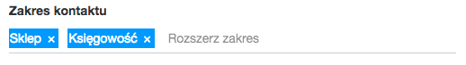

## ng2-tags ##

Taggs for angular 2 apps.

import it

    import {TagInputComponent} from 'ng2-tags/ng2-tags';

include it

    ....
     directives: [TagInputComponent]
    ....

use it in html

    <tags placeholder="Expand Range" 
        [(ngModelArray)]="some_string_array" delimiterCode="188"   >
    </tags>

rest of api

| Attribute | Type | required  | Description 
| :---: | --- | --- | ---: |
| **ngModelArray** | string[] | yes |  Property to store the resulting tag list in |
| **placeholder** | string | no |  Placeholder for the `<input>` tag |
| **delimiterCode** | string | no |  ASCII keycode to split tags on. Defaults to comma |
| **addOnBlur** | boolean | no |  Whether to attempt to add a tag when the input loses focus |
| **addOnEnter** | boolean | no |  Whether to attempt to add a tag when the user presses enter. |
| **addOnPaste** | boolean | no |  Whether to attempt to add a tags when the user pastes their clipboard contents |
| **allowedTagsPattern** | RegExp | no |  RegExp that must match for a tag to be added |

